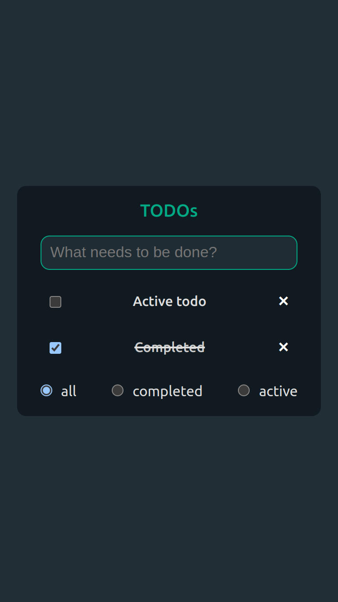

# sourtodo

A minimal TODO app built using [soursop](https://github.com/soursop-js/soursop), [sourstore](https://github.com/natanfeitosa/sourstore) and vite



# How to run

1. Install the dependencies
   ```bash
   npm install
   # or using yarn
   # yarn install
   ```
2. Now you can run the project
   ```bash
   npm run dev
   # or using yarn
   # yarn dev
   ```
